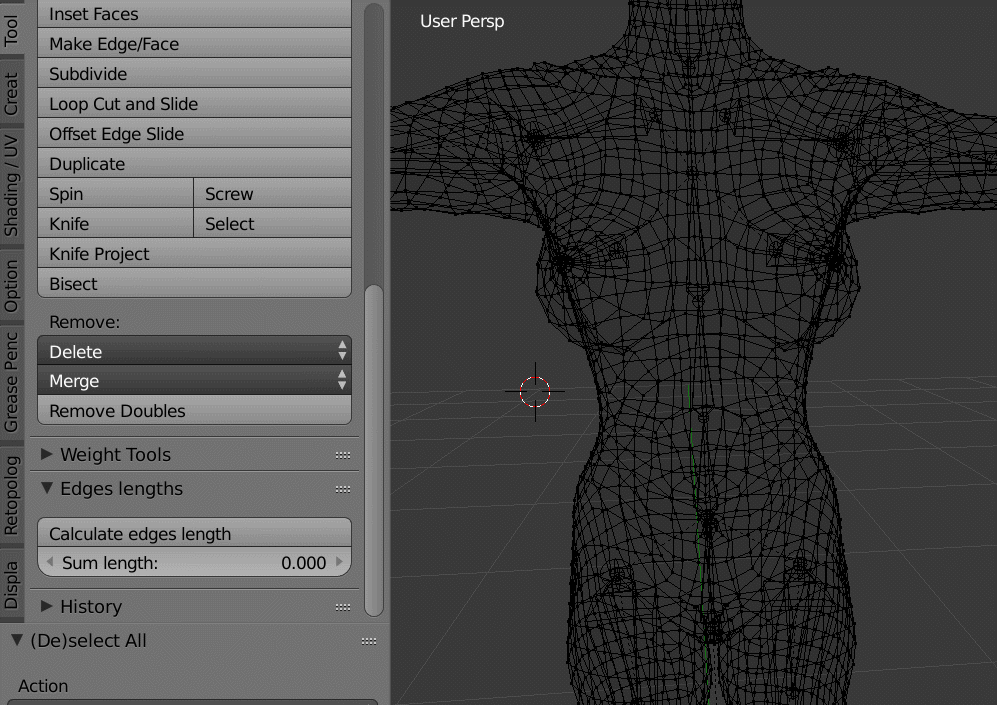

# blender_addons

EdgesLength - simple addon fot blender (tested on blender 2.79) for calculating total length of selected edges. Helpful if you would like to measure the object dimensions, circumference, girth or any vertices path that is selected

